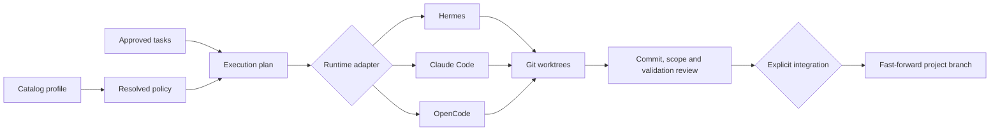

# DevPlane

[](https://github.com/dcosodev/devplane/actions/workflows/ci.yml)
[](https://www.python.org/)
[](LICENSE)
[](#project-status)

A local-first organizational capability catalog and multi-agent development control plane.

DevPlane lets a team version reusable engineering instructions, permissions, validations, and project profiles independently from the coding agent that applies them. The same resolved catalog can govern Hermes, Claude Code, or OpenCode implementation sessions.

> DevPlane is an independent open-source project. It is not affiliated with, sponsored by, or endorsed by GitHub, Nous Research, Anthropic, OpenCode, or MiniMax.

## What the repository contains

DevPlane has three explicit layers:

| Layer | Responsibility | Agent-specific? |
| --- | --- | --- |
| **Catalog** | Versioned capabilities, profiles, Markdown instructions, write scopes, shell allowlists, and validations | No |
| **Control plane** | Resolution, approvals, execution plans, Git worktrees, retries, audit records, validation, and integration | No |
| **Runtime adapters** | Translate a governed assignment into a supported agent CLI invocation | Yes |

GitHub Spec Kit is an optional external producer for `specify → plan → tasks`. DevPlane does not fork or vendor it. The catalog can also be used without Spec Kit and without an agent runtime.

## Catalog

A catalog composes small capabilities into reusable development profiles:

```text
sample-base + python-quality  → python-service
sample-base + web-quality     → web-frontend
sample-base + docs-quality    → documentation
```

Each capability can contribute:

- instructions included in planning or implementation context;
- write-scope and shell-command policy data;
- exact validation commands;
- an immutable ID and version.

A project selects a profile and can add extra capabilities:

```yaml
apiVersion: devplane.dev/v1
kind: AgentProject
metadata:
  name: payments-api
spec:
  catalog:
    source: ../engineering-catalog
  profile: python-service
  capabilities:
    - regulated-data@2.0.0
  runtime:
    adapter: claude
    model: sonnet
```

`devplane sync` resolves that source into deterministic generated state with a source hash. Catalog-only commands never execute catalog scripts or validation commands.

Read [`docs/catalog.md`](docs/catalog.md) for the schema and composition rules.

## Control plane

When execution is enabled, DevPlane turns reviewed task artifacts into bounded assignments:



The execution plan binds:

- the approved Git base;
- task and resolved-manifest digests;
- assignment dependencies and allowed paths;
- exact validation commands.

The project branch does not move while agents work. DevPlane verifies commits and diffs after execution, validates in isolated worktrees, and integrates only through an explicit fast-forward gate.

## Runtime adapters

Built-in adapters:

| Adapter | Executable contract | Model/provider configuration |
| --- | --- | --- |
| `hermes` | `hermes chat --query ...` | provider, model, toolsets, max turns |
| `claude` | `claude --print ...` | model, permission mode, allowed tools |
| `opencode` | `opencode run ...` | `provider/model`, agent |

List them:

```bash
uv run devplane adapters
```

Select a runtime without changing the catalog:

```bash
uv run devplane runtime hermes \
  --provider minimax-oauth \
  --model MiniMax-M3 \
  --project ../service

uv run devplane runtime claude \
  --model sonnet \
  --project ../service

uv run devplane runtime opencode \
  --model anthropic/claude-sonnet-4-5 \
  --project ../service
```

The adapters use argument arrays, never a shell command string. DevPlane does not bypass Claude Code or OpenCode permission controls. Authentication, model availability, account policy, and runtime-level tool permissions remain external responsibilities.

The automated suite verifies adapter selection, argument construction, prompt isolation, and control-plane integration without consuming model tokens. Real paid execution requires the selected CLI to be installed and authenticated.

Read [`docs/runtime-adapters.md`](docs/runtime-adapters.md) before configuring a runtime.

## Quick start: catalog only

Prerequisites: Python 3.11+, Git, and [uv](https://docs.astral.sh/uv/).

```bash
git clone https://github.com/dcosodev/devplane.git
cd devplane
uv sync --extra test

uv run devplane init ../service \
  --catalog ./examples/catalog \
  --workflow none \
  --runtime none

uv run devplane use-profile python-service --project ../service
uv run devplane sync --project ../service
uv run devplane validate --project ../service
uv run devplane inspect --project ../service
uv run devplane context implement --project ../service
```

This path needs neither Spec Kit nor an agent CLI.

A project can also add an exact capability outside its selected profile:

```bash
uv run devplane activate sample-base@1.0.0 --project ../service
```

## Quick start: governed execution with another agent

Create a clean Git project with the OpenCode adapter and no specification engine:

```bash
uv run devplane new ../service \
  --catalog ./examples/catalog \
  --workflow none \
  --runtime opencode

uv run devplane use-profile python-service --project ../service
uv run devplane runtime opencode \
  --model openai/gpt-5.3-codex \
  --project ../service
```

Commit the selected profile and generated state, then provide an approved tasks file and create a plan:

```bash
uv run devplane plan-execution \
  --tasks-file tasks.md \
  --run-id service-001 \
  --project ../service

uv run devplane implement \
  --parallel \
  --execution-plan ../service/.git/devplane/runs/service-001/execution-plan.yaml \
  --dry-run \
  --project ../service
```

`python-service` contributes default validation commands. Passing `--validation` explicitly overrides catalog defaults.

Remove `--dry-run` only after reviewing the plan and authenticating the selected runtime. Then inspect and integrate explicitly:

```bash
uv run devplane run-status service-001 --project ../service
uv run devplane integrate service-001 --project ../service
```

## Optional Spec Kit workflow

The human-gated `specify → plan → tasks` path remains available:

```bash
uv tool install specify-cli --from git+https://github.com/github/spec-kit.git@f36634b5c1463d3592382e863cd5e7b8a94d9c9a

uv run devplane new ../service \
  --catalog ./examples/catalog \
  --workflow speckit \
  --runtime claude
```

Spec Kit's currently supported phase integration is Hermes-specific, even when a different adapter implements the approved tasks. In other words:

- Spec Kit + Hermes can produce the specification, plan, and tasks;
- DevPlane owns approvals, contracts, worktrees, validation, and integration;
- Hermes, Claude Code, or OpenCode can execute the implementation assignments.

DevPlane never calls Spec Kit's monolithic implementation phase in the governed flow.

See [`docs/quickstart.md`](docs/quickstart.md) for the complete walkthrough.

## Commands

| Command | Purpose |
| --- | --- |
| `init`, `new` | Initialize an existing or greenfield project, with optional workflow/runtime |
| `adapters`, `runtime` | List and select agent runtime adapters |
| `use-profile`, `activate` | Select a catalog profile and add explicit capabilities |
| `sync`, `validate`, `inspect`, `context` | Resolve and verify deterministic catalog state |
| `profile` | Detect repository evidence and optionally approve it |
| `run`, `approve` | Optional human-gated Spec Kit phases |
| `checkpoint`, `plan-execution` | Create an approved base and immutable execution plan |
| `implement --parallel` | Run bounded assignments with the selected adapter |
| `run-status`, `retry` | Inspect state and recover failed assignments |
| `integrate` | Validate and fast-forward the approved result |
| `cleanup` | Preview or apply safe worktree cleanup |

Run `uv run devplane COMMAND --help` for exact options.

## Security boundary

DevPlane is not an operating-system sandbox.

Git worktrees isolate branches and files, not processes, network access, credentials, or the host filesystem. Agent runtimes can access whatever the host account and their own permission systems allow. DevPlane's write-scope enforcement is authoritative after execution rather than syscall-level prevention.

Catalog YAML and Markdown are configuration and prompt material. Treat external catalogs like code: review them before use. Validation commands are executable contract data and must be trusted. Catalogs are not signed, and local JSONL audit logs are not cryptographically chained.

Read [`SECURITY.md`](SECURITY.md) and [`docs/architecture.md#security-boundary`](docs/architecture.md#security-boundary).

## Development and verification

```bash
uv sync --extra test
uv run pytest --cov=devplane --cov-report=term-missing --cov-fail-under=80
uv run ruff check src tests
uv run python -m compileall -q src tests
uv build
uv run twine check dist/*
git diff --check
```

The test suite uses temporary repositories and fake agent runners. It does not require credentials or consume model tokens.

## Project status

`v0.2.1` is alpha. The catalog schema, runtime adapter API, and CLI may change before `1.0`.

Implemented now:

- local versioned capabilities and reusable profiles;
- deterministic composition and generated context;
- catalog-only operation without Spec Kit or an agent;
- Hermes, Claude Code, and OpenCode implementation adapters;
- optional human-gated Spec Kit workflow;
- integrity-bound plans, worktrees, retries, validation, audit, and integration.

Not implemented:

- a hosted catalog registry or remote package resolver;
- cryptographic catalog signatures;
- an OS-level sandbox;
- arbitrary third-party adapter plugins;
- a non-Hermes Spec Kit phase integration;
- cryptographically chained audit logs.

## Contributing

Read [`CONTRIBUTING.md`](CONTRIBUTING.md), [`CODE_OF_CONDUCT.md`](CODE_OF_CONDUCT.md), and [`docs/architecture.md`](docs/architecture.md) before opening a pull request.

## License and trademarks

DevPlane is available under the [MIT License](LICENSE). Third-party names identify external integrations only; see [`NOTICE`](NOTICE).
