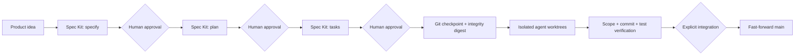

# DevPlane

[](https://github.com/dcosodev/devplane/actions/workflows/ci.yml)
[](https://www.python.org/)
[](LICENSE)
[](#project-status)

A local-first control plane for governed, specification-driven AI software delivery with [GitHub Spec Kit](https://github.com/github/spec-kit) and [Hermes Agent](https://hermes-agent.nousresearch.com/docs).

DevPlane turns approved product artifacts into bounded implementation assignments, runs coding agents in isolated Git worktrees, verifies their commits and tests, and integrates the result only through an explicit fast-forward gate.

> DevPlane is an independent open-source project. It is not affiliated with or endorsed by GitHub, Nous Research, or MiniMax.

## Why DevPlane?

AI coding agents can generate code quickly, but production delivery needs more than generation:

- a reviewed specification before implementation;
- explicit human approval between phases;
- immutable task and validation contracts;
- bounded write scopes for every worker;
- isolated parallel execution;
- deterministic failure, retry, and integration behavior;
- evidence that the final result actually passed its native checks.

DevPlane provides that control layer while leaving Spec Kit and Hermes independently installable and upgradeable.

## Delivery flow



DevPlane never calls Spec Kit's monolithic implementation phase in the governed flow. It owns task decomposition, execution contracts, worktree orchestration, validation, retry, and final integration.

## Core guarantees

- **Human-gated SDD:** `specify`, `plan`, and `tasks` advance one approved phase at a time.
- **Immutable execution contract:** plans bind the Git base, source task digest, resolved manifest digest, dependency graph, write scopes, and exact validation commands.
- **Isolated implementation:** setup, foundation, stories, and polish run in dedicated Git worktrees without moving the project branch.
- **Bounded concurrency:** independent user stories may run concurrently; dependent assignments wait for verified bases.
- **Fail-closed review:** unexpected commits, dirty worktrees, out-of-scope paths, governance changes, failed tests, and integration drift block progress.
- **Selective recovery:** retries reuse only completed assignments whose base and commit remain valid.
- **Explicit integration:** the final branch moves only after full validation and `git merge --ff-only`.
- **Safe cleanup:** cleanup is a dry run by default and preserves non-equivalent work.

## Quick start

### Prerequisites

- Python 3.11+
- [uv](https://docs.astral.sh/uv/)
- Git
- [GitHub Spec Kit](https://github.com/github/spec-kit) (`specify`)
- [Hermes Agent](https://hermes-agent.nousresearch.com/docs)
- a configured Hermes `minimax-oauth` provider with `MiniMax-M3` for the current alpha execution backend

Install DevPlane for development:

```bash
git clone https://github.com/dcosodev/devplane.git
cd devplane
uv sync --extra test
uv run devplane --help
```

Install the currently verified Spec Kit revision separately:

```bash
uv tool install specify-cli --from git+https://github.com/github/spec-kit.git@f36634b5c1463d3592382e863cd5e7b8a94d9c9a
```

Create a governed greenfield project:

```bash
uv run devplane new ../meeting-booking \
  --catalog ./examples/catalog

uv run devplane run \
  "Build a secure meeting booking service" \
  --stop-after tasks \
  --run-id meeting-booking-001 \
  --project ../meeting-booking
```

Review each generated artifact before advancing:

```bash
uv run devplane approve meeting-booking-001 spec  --project ../meeting-booking
uv run devplane approve meeting-booking-001 plan  --project ../meeting-booking
uv run devplane approve meeting-booking-001 tasks --project ../meeting-booking
```

Create the approved checkpoint and execution contract:

```bash
uv run devplane checkpoint meeting-booking-001 \
  --tasks-file ../meeting-booking/specs/001-meeting-booking/tasks.md \
  --validation "uv run pytest" \
  --project ../meeting-booking
```

Inspect before spending model calls:

```bash
uv run devplane implement \
  --parallel \
  --execution-plan ../meeting-booking/.git/devplane/runs/meeting-booking-001/execution-plan.yaml \
  --dry-run \
  --project ../meeting-booking
```

Then execute, inspect, and integrate explicitly:

```bash
uv run devplane implement \
  --parallel \
  --max-agents 3 \
  --execution-plan ../meeting-booking/.git/devplane/runs/meeting-booking-001/execution-plan.yaml \
  --project ../meeting-booking

uv run devplane run-status meeting-booking-001 --project ../meeting-booking
uv run devplane integrate meeting-booking-001 --project ../meeting-booking
```

See [`docs/quickstart.md`](docs/quickstart.md) for the full walkthrough, including retry and cleanup.

## Existing repositories

DevPlane can profile and initialize an existing repository without replacing its stack:

```bash
uv run devplane init ../existing-service --catalog ./examples/catalog
uv run devplane sync --project ../existing-service
uv run devplane profile --project ../existing-service
uv run devplane profile --approve --project ../existing-service
```

Repository evidence never activates capabilities automatically. Activation remains an explicit architectural decision:

```bash
uv run devplane activate sample-base@1.0.0 --project ../existing-service
```

## Architecture

DevPlane separates four responsibilities:

| Component | Responsibility |
| --- | --- |
| GitHub Spec Kit | Specification, planning, and task artifact semantics |
| DevPlane | Approvals, manifests, contracts, lifecycle, verification, and integration |
| Hermes Agent | Persistent orchestration runtime |
| MiniMax-M3 sessions | Bounded implementation workers in isolated worktrees |

Read [`docs/architecture.md`](docs/architecture.md) for state boundaries, execution-plan integrity, cumulative implementation, and the security model.

## Commands

| Command | Purpose |
| --- | --- |
| `new` | Bootstrap a greenfield Git project with Spec Kit and DevPlane |
| `init` | Add Spec Kit/Hermes and DevPlane state to an existing repository |
| `sync`, `validate`, `inspect`, `context` | Resolve and verify deterministic catalog state |
| `profile`, `activate` | Approve repository evidence and explicit capabilities |
| `run --stop-after tasks`, `approve` | Execute the human-gated SDD phases |
| `checkpoint`, `plan-execution` | Create the approved base and immutable execution plan |
| `implement --parallel` | Run bounded implementation sessions in worktrees |
| `run-status`, `retry` | Inspect persisted state and recover failed assignments |
| `integrate` | Validate and fast-forward the approved result |
| `cleanup` | Preview or apply safe worktree cleanup |

Run `uv run devplane COMMAND --help` for exact options.

## Development and verification

The unit and controlled E2E tests use temporary repositories and fake external executables. They do not require credentials or consume model tokens.

```bash
uv sync --extra test
uv run pytest
uv run pytest --cov=devplane --cov-report=term-missing
uv run python -m compileall -q src tests
uv run ruff check src tests
uv export --quiet --format requirements-txt --no-emit-project --extra test --output-file /tmp/devplane-audit-requirements.txt
uv run pip-audit --strict -r /tmp/devplane-audit-requirements.txt
uv run bandit -q -r src --severity-level medium
uv build
uv run devplane --help
git diff --check
```

## Security boundary

DevPlane is a control plane, not an operating-system sandbox.

It validates inputs, symlink containment, Git identifiers, plan digests, allowed paths, governance paths, commits, worktree cleanliness, and validation results. Agent tools can still access whatever the host account and runtime allow. Write-scope enforcement is authoritative after execution rather than syscall-level prevention.

Do not use untrusted catalogs, prompts, repositories, or validation commands. Review the [remaining limitations](docs/architecture.md#security-boundary) and report vulnerabilities privately through [`SECURITY.md`](SECURITY.md).

## Project status

`v0.1.0` is an alpha portfolio release. The core governed flow is implemented and covered by a controlled end-to-end test, but the public API and integration compatibility may still change before `1.0`. See [`CHANGELOG.md`](CHANGELOG.md) for release history.

Current intentional constraints:

- Hermes Agent is the only supported coordinator runtime.
- The implementation runner is fixed to `minimax-oauth/MiniMax-M3`.
- Catalog Markdown is trusted prompt material and is not signed.
- Validation commands are explicit user-approved contract data.
- Audit JSONL is local and not cryptographically chained.

See [open issues](https://github.com/dcosodev/devplane/issues) for planned work.

## Contributing

Contributions are welcome. Read [`CONTRIBUTING.md`](CONTRIBUTING.md), the [`CODE_OF_CONDUCT.md`](CODE_OF_CONDUCT.md), and the architecture constraints before opening a pull request.

## License and trademarks

DevPlane is available under the [MIT License](LICENSE). Third-party project names identify external integrations only; see [`NOTICE`](NOTICE).
